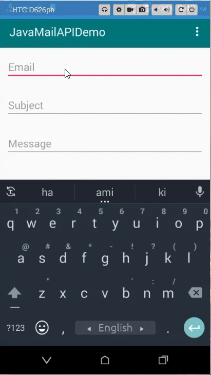

# JavaMailAPIDemo
This is a android app practice project. I have implemented JAVAMIAL API with Gmail.

## App overview 

public class Utils {

    //This is your from email
    public static final String EMAIL = "Set your from gmail here";

    //This is your from email password
    public static final String PASSWORD = "Set your from gmail password";
}

# Important
## You can get this warning from your gmail
Critical security alert for your linked Google Account

Access for less secure apps setting has been turned on for your linked account

If you got this mail please goto your mail account settings->Security : Enable less secure app access

That's it!
